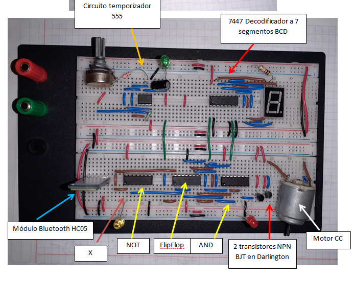

# Digital-systems
A repository for my Digital systems class

Some files in folders are present in .txt files as a code symbolic representaiton, it is required to download "Constructor virtual de circuitos" to visualize the wiring diagram, breadboard, digital states, LEDs, etc.

I have built several circuits with different configurations to develop electronics skills.

# Tools and software mastered in Digital electronics class are the following
1. Reviewed and interpreted Integrated circuits to execute the optimal design.
2. Extracted information from Electronics datasheet.
3. Engineered functional block diagrams to design in PROTEUS schematics.
4. Arduino IDE & hardware programmed for specific tasks.

Examples of projects I've worked in.

 
 
 
 
 
 
 

